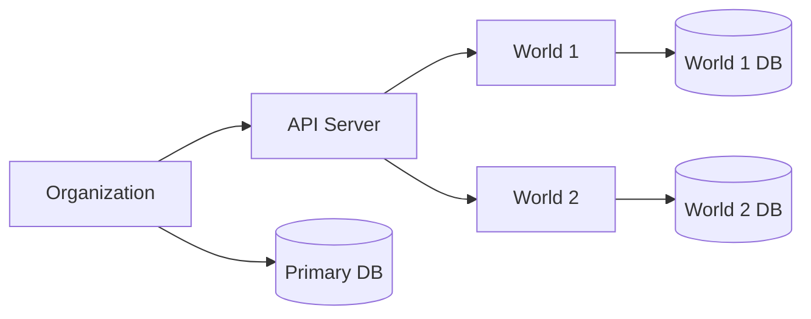

Understanding the relationship between **Organizations** and **Worlds** is key to managing the platform.

### Organization (Tenant Level)

An Organization is the top-level grouping managed by the **Console**. When you provision an Organization, the platform creates:

- **Worlds API Server**: A dedicated instance of the server (Deno process or Deno Deploy App) and the associated base URL.
- **Primary libSQL DB**: Stores metadata and the registry of worlds within that organization.
- **Admin API Key**: A unique secret that secures the entire Organization's API surface.

### World (Domain Level)

A World is a specific context or "graph" managed _by_ the Organization's server.

- **Managed by WorldServer**: Worlds are sub-resources accessed via the Org's Base URL (e.g., `/v1/worlds/{id}`).
- **Dedicated Storage**: Each World has its own **secondary libSQL database** (SQLite file or per-world Turso DB) for its specific triples and embeddings.
- **Polymorphic Provisioning**: Just like Organizations, Worlds can be stored locally on disk or provisioned as cloud databases.

