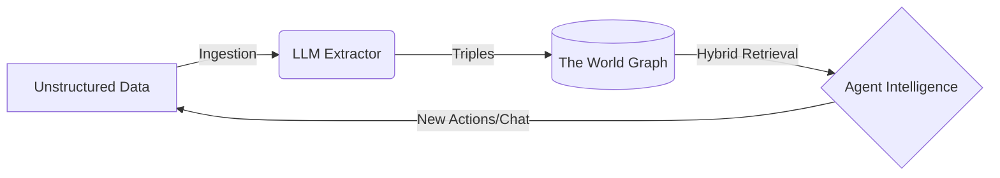

# How Worlds Work

Worlds provides a structured framework for thinking about **Agent Memory**.
Instead of treating an agent's context as a flat list of chat logs or disjointed
text chunks (like traditional RAG), Worlds organizes information as a **dynamic,
queryable model of the world**.

## The Worlds Pipeline

To understand how Worlds powers intelligent agents, you need to understand the
lifecycle of data moving through the platform.

### 1. Ingestion (The Input)

Raw information enters the system from an external source. This could be a user
chatting with an assistant, an agent reading a GitHub repository, or a direct
API call sending a PDF document. At this stage, the data is entirely
unstructured.

### 2. Processing (The Neuro-Symbolic Engine)

Once ingested, the Worlds Engine goes to work. An intelligent extraction layer
(powered by LLMs) reads the unstructured data and identifies the core entities,
relationships, and concepts being discussed. It breaks the text down into its
semantic components, translating ambiguous human language into structured logic.

### 3. Graph Evolution (The State)

The newly extracted knowledge is pushed into a **World** (an isolated container
for knowledge).

- **Resonance:** If the data describes something totally new, it is added to the
  graph.
- **Evolution:** If the data contradicts or updates an existing fact (e.g., "The
  user moved from New York to London"), the system automatically deprecates the
  old fact and creates the new connection. This continual learning loop means
  the agent's memory is always up-to-date and accurate without manual
  intervention.

### 4. Retrieval (The Output)

When an agent needs context to answer a query or perform a task, it doesn't just
do a keyword search. It performs a **Hybrid Search**, mixing semantic vector
similarity with deterministic graph traversal to pull a highly precise, grounded
slice of reality directly into its context window.

## The Mental Model

Think of a World as a **Living Knowledge Primitive**.

In traditional apps, you query a database for records. In AI apps powered by
Worlds, your agent traverses a digital replica of its environment that evolves
constantly as it interacts with users and tools.

<CardGroup cols={2}>
  <Card
    title="Worlds vs. Traditional RAG"
    icon="scale-balanced"
    href="/concepts/worlds-vs-rag"
  >
    Understand the fundamental difference between generic vector search and
    stateful memory.
  </Card>
  <Card
    title="Knowledge Primitives"
    icon="diagram-project"
    href="/concepts/knowledge-primitives"
  >
    Learn exactly how Worlds stores extracted facts as Entities and Triples.
  </Card>
</CardGroup>
