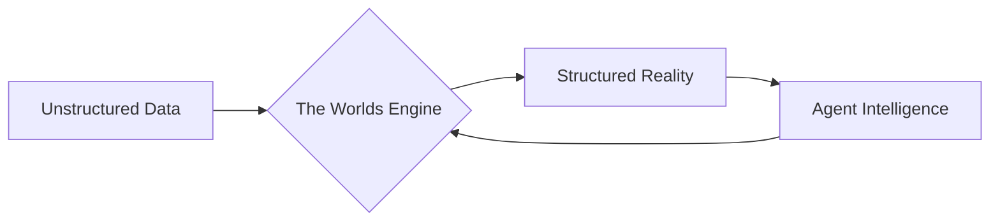

# How Worlds Work

Worlds provides a structured framework for thinking about agent memory. Instead
of a flat list of text chunks, Worlds organizes information as a **dynamic,
queryable model of the world**.

## The Life of a Triple

At the core of Worlds is the concept of a **Triple**—a discrete piece of
atomized knowledge. The lifecycle of this knowledge follows a predictable path
through the platform:

1. **Ingestion**: Raw information enters from an external source (a chat
   message, a GitHub repository, or a local file).
2. **Materialization**: An LLM or predefined schema bridge extracts the
   subjects, predicates, and objects, turning raw text into a **Knowledge
   Graph**.
3. **Resonance**: The new knowledge is merged with existing state. Conflicts are
   resolved, and relationships are automatically discovered via logical
   inference.
4. **Retrieval**: When an agent needs context, the system performs a
   high-precision lookup, providing a grounded slice of reality instead of a
   probabilistic guess.

## The Mental Model

Think of a World as a **Living Knowledge Primitive**. It is not just a database;
it is a stateful representation of an agent's understanding.

<CardGroup cols={2}>
  <Card
    title="Knowledge Primitives"
    icon="diagram-project"
    href="/concepts/knowledge-primitives"
  >
    Learn about the objects that make up a World.
  </Card>
  <Card
    title="Neuro-Symbolic Architecture"
    icon="brain"
    href="/concepts/neuro-symbolic"
  >
    The engine that powers the neural-to-symbolic transition.
  </Card>
</CardGroup>
