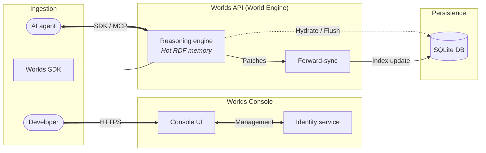
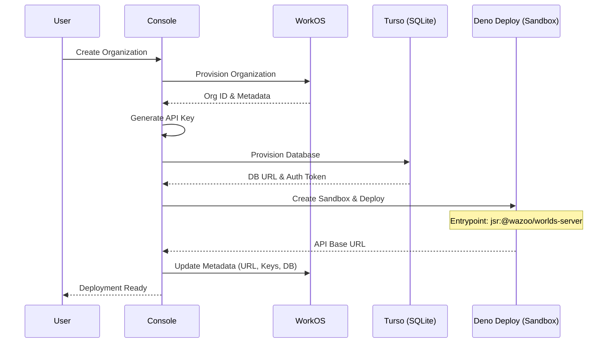
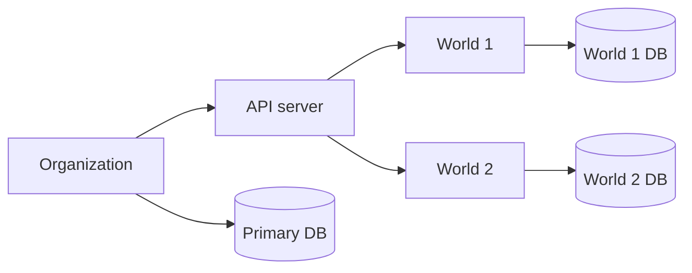
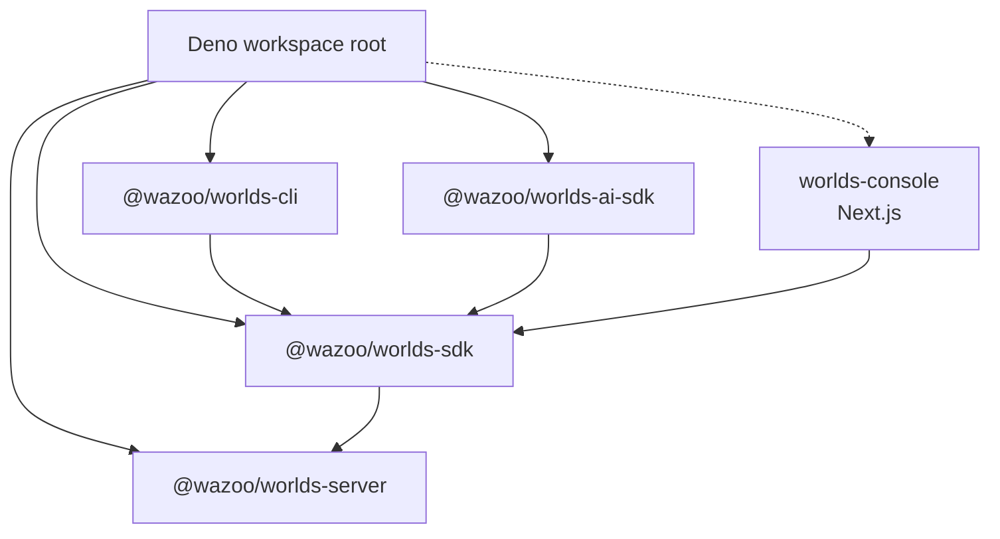

The Worlds Platform utilizes a managed [neuro-symbolic](/manifesto)
infrastructure designed for edge-distributed, agentic memory. Built on the
[Deno](https://deno.com/) runtime, it separates the **Worlds Console** for
management from the **Worlds API** for high-performance execution.

## The connection model

The connection model uses composable components to scale system complexity:

- **Client**: Use the `@wazoo/worlds-sdk` or standard HTTP requests inside an
  agent like Claude, Gemini, or a custom script to connect to the platform.
- **Memory**: A World is an isolated sandbox for agent memories. You must target
  a specific World using an API key and the World ID for every request.
- **Dashboard**: Use the Worlds Console to generate API keys, explore data, and
  manage billing.

<Info>Agents use an API key to read and write facts to a specific World.</Info>

## High-level overview

The diagram illustrates the relationship between the management layer, reasoning
engine, and isolated persistent state.

## Worlds Console vs. Worlds API

The platform splits operations into two primary layers:

<Columns>
  

### Worlds Console

The **Worlds Console** acts as the system's control plane. It manages identity
through WorkOS, handles organization-level provisioning, and orchestrates
**Worlds API** instances.

  

  

### Worlds API

The **Worlds API Server** handles RDF graph management, [SPARQL](/worlds/query)
execution, and [hybrid search](/worlds/search). This is the API layer where your
information lives.

  

</Columns>

## Automated provisioning

The connection between the Worlds Console and the API Server is automated
through a robust provisioning layer. This ensures that every organization has a
dedicated, isolated API instance.

### App management abstraction

The system utilizes an `AppManager` interface (located in
`packages/console/src/lib/apps`) to abstract the deployment of the API server.
This allows the platform to seamlessly switch between local development and
production environments:

- **Local Development**: Uses `LocalAppManager` to spawn background `deno serve`
  processes. It manages port allocation and maps organization logins to local
  child processes.
- **Production**: Uses `DenoAppManager` to interact with the Deno Deploy API. It
  leverages **Deno sandboxes** to orchestrate new projects and manage automated
  deployments of the latest server builds.

### Bootstrap flow

The console orchestrates the lifecycle of an API server from initial
organization setup to production deployment.

<Note>
  The `Worlds API` is stateless by design. All state is persisted in the
  provisioned SQLite/Turso databases, allowing the API server to be
  re-provisioned or scaled instantly.
</Note>

## Worlds API deep dive

<Accordion title="API data flow">
  The World Engine transforms raw data inputs into a neuro-symbolic knowledge state.

</Accordion>

## Storage engine

The platform uses a hybrid storage strategy to combine vector search with graph
logic.

### Hot memory

The platform utilizes a WASM-compiled RDF store that runs entirely within the
JavaScript runtime. This maintains an in-memory state in the edge cache between
requests to reduce read latency.

### Persistence and indexing

Persistence utilizes an edge-distributed database to maintain semantic
integrity. The system relies on a multi-index strategy:

- **Graph indexing**: Stores structural data records as an append-only
  chronological ledger. This enables rapid pattern matching.
- **Vector indexing**: Stores high-dimensional embeddings for text segments.
  This enables semantic similarity search at the edge.
- **Full-text indexing**: Provides exact keyword matching and ranking.

When executing a search, the engine utilizes Reciprocal Rank Fusion (RRF) to
combine results from the vector index and full-text index into a single, unified
relevance ranking. Structural graph constraints further restrict these results.

## Resource hierarchy

**Organizations** host **Worlds** to ensure strict data isolation and scale.

### Worlds

Each World is a specific context or knowledge graph managed by the server.

- **Dedicated storage**: Each World maintains its own secondary SQLite database
  for [triples](/worlds#facts), chunks, and embeddings.
- **Isolation**: Access Worlds via `/v1/worlds/{id}` to ensure zero
  cross-contamination between contexts.

## Deno runtime

Worlds uses the [Deno](https://deno.com/) runtime for its
[security](https://docs.deno.com/runtime/fundamentals/security/) and runtime
capabilities:

- **Secure by default**: Deno's permission model requires explicit grants for
  network, file system, and environment access. This reduces the attack surface
  of each deployment.
- **Web-standard APIs**: The server exports a standard `fetch` handler, making
  it natively compatible with edge distribution platforms like Deno Deploy.
- **TypeScript-native**: No build step or transpiler configuration required. The
  entire codebase is TypeScript from source to execution.
- **Edge-ready**: Native support for Deno Deploy enables low-latency
  distribution close to users.

## Monorepo topology

The ecosystem uses a Deno workspace. The `sdk` package serves as the primary
bridge for the CLI, AI-SDK, and Console to communicate with the API Server.

### Repository layout

The server follows a modular layout organized by service and resource:

- `lib/`: Shared logic for RDF/SPARQL handling, database management, and
  embeddings.
- `middleware/`: Authentication guards.
- `routes/`: Implementation of the v1 API endpoints.

## Request flow

The Worlds Server follows a structured lifecycle for initialization and request
handling.

## Alignment and agency

RLHF transforms Worlds from a statistical mimicry engine into a system of
intentional agency. By treating human feedback as
[verifiable state](/worlds/update#feedback-ingestion), Worlds enables a
recursive quality loop where the system continuously optimizes its ontology and
probability landscape to align with human intent.

Learn more about recursive state refinement and recursive learning in the
[Alignment](/worlds/alignment) deep-dive.

## Design principles

### Polymorphic resource managers

A key design feature is the use of hot-swappable resource managers. The core
logic remains identical, while the implementation swaps based on the
environment:

| Resource     | Local development     | Production                       |
| :----------- | :-------------------- | :------------------------------- |
| **Compute**  | Local child processes | Deno Deploy (via Deno Sandboxes) |
| **Storage**  | Local SQLite files    | SQLite / Turso                   |
| **Identity** | Mock identity file    | WorkOS Identity Service          |

This pattern allows the entire stack to run locally with zero cloud
dependencies.
