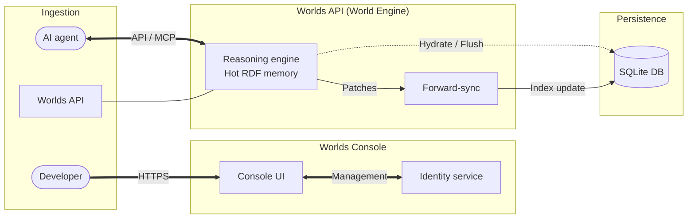
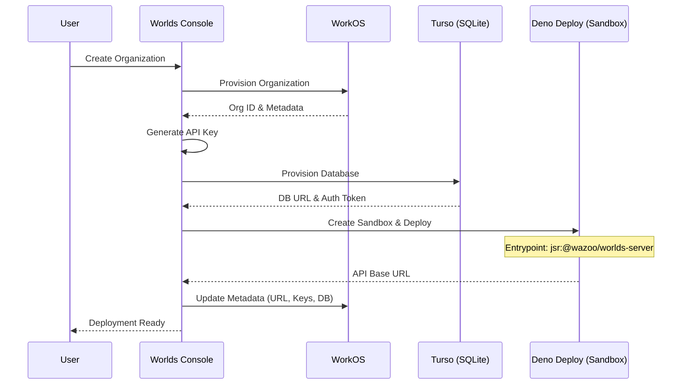
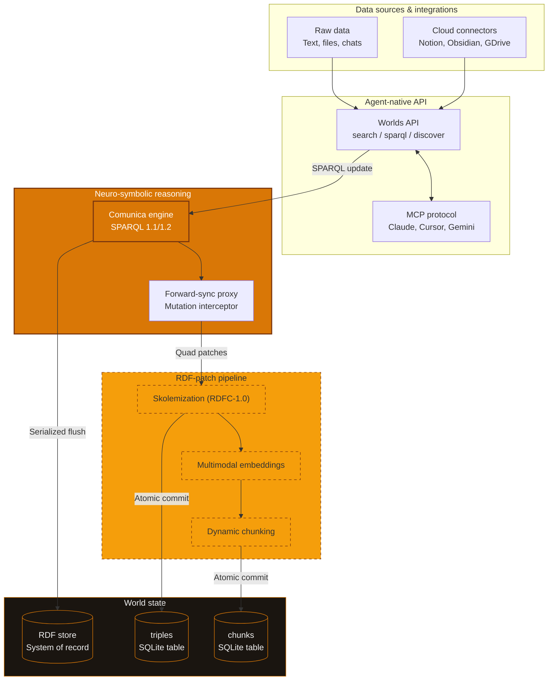
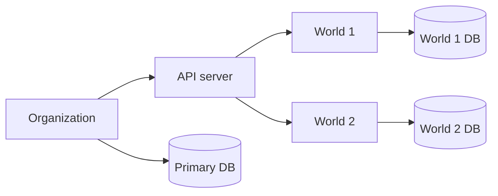
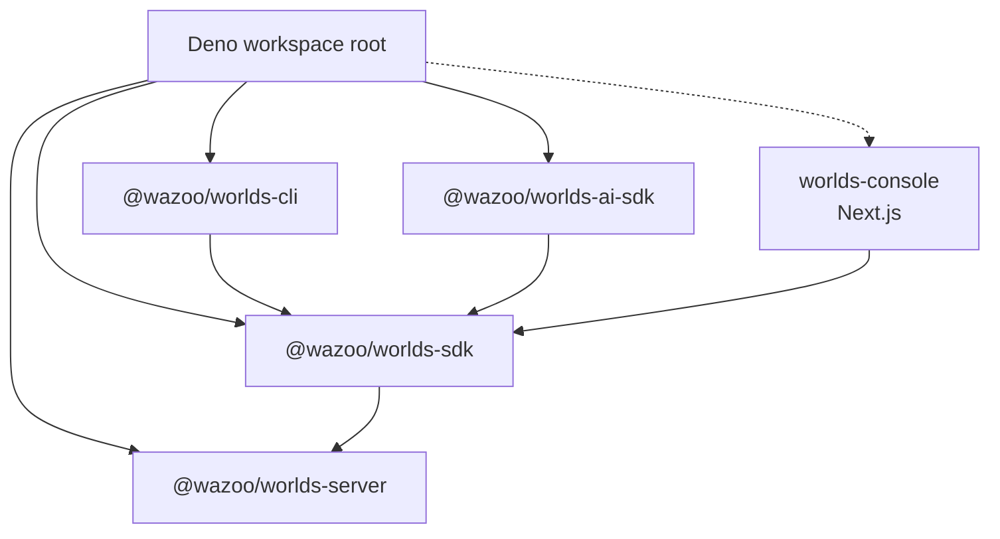

The Worlds Platform utilizes a managed [neuro-symbolic](/manifesto)
infrastructure designed for edge-distributed, agentic memory. Built on the
[Deno](https://deno.com/) runtime, it separates the Worlds console for
management from the Worlds API for high-performance execution.

## The connection model

The connection model uses composable components to scale system complexity:

- Client: Use the `@wazoo/worlds-sdk` or standard HTTP requests inside an agent
  like Claude, Gemini, or a custom script to connect to the Worlds API.
- Memory: A World is an isolated sandbox for agent memories. You must target a
  specific World using an API key and the World ID for every request.
- Dashboard: Use the Worlds Console to generate API keys, explore data, and
  manage billing.

<Info>Agents use an API key to read and write facts to a specific World.</Info>

## High-level overview

The diagram illustrates the relationship between the management layer, reasoning
engine, and isolated persistent state.

## Worlds Console vs. Worlds API

The platform splits operations into two primary layers:

<Columns>
  

### Worlds Console

The Worlds Console acts as the system control plane. It manages identity through
WorkOS, handles organization-level provisioning, and orchestrates Worlds API
instances.

  

  

### Worlds API

The Worlds API Server handles RDF graph management, [SPARQL](/worlds/query)
execution, and [hybrid search](/worlds/search). This is the API layer where your
information lives.

  

</Columns>

## Automated provisioning

The connection between the Worlds Console and the Worlds API Server is automated
through a provisioning layer. This ensures that every organization has a
dedicated, isolated API instance.

### App management abstraction

The system utilizes an `AppManager` interface (located in
`packages/console/src/lib/apps`) to abstract the deployment of the Worlds API
server. This allows the platform to seamlessly switch between local development
and production environments:

- Local development: Uses `LocalAppManager` to spawn background `deno serve`
  processes. It manages port allocation and maps organization logins to local
  child processes.
- Production: Uses `DenoAppManager` to interact with the Deno Deploy API. It
  leverages Deno sandboxes to orchestrate new projects and manage automated
  deployments of the latest server builds.

### Bootstrap flow

The Worlds Console orchestrates the lifecycle of a Worlds API server from
initial organization setup to production deployment.

<Note>
  The Worlds API is stateless by design. All state is persisted in the
  provisioned SQLite/Turso databases, allowing the Worlds API server to be
  re-provisioned or scaled instantly.
</Note>

## Worlds API deep dive

<Accordion title="API data flow">
  The World Engine transforms raw data inputs into a neuro-symbolic knowledge state.

</Accordion>

## Storage engine

The platform uses a hybrid storage strategy to combine vector search with graph
logic.

### Hot memory

The platform utilizes a WASM-compiled RDF store that runs entirely within the
JavaScript runtime. This maintains an in-memory state in the edge cache between
requests to reduce read latency.

### Persistence and indexing

Persistence utilizes an edge-distributed database to maintain semantic
integrity. The system relies on a multi-index strategy:

- Graph indexing: Stores structural data records as an append-only chronological
  ledger. This enables rapid pattern matching.
- Vector indexing: Stores high-dimensional embeddings for text segments. This
  enables semantic similarity search at the edge.
- Full-text indexing: Provides exact keyword matching and ranking.

When executing a search, the engine utilizes Reciprocal Rank Fusion (RRF) to
combine results from the vector index and full-text index into a single, unified
relevance ranking. Structural graph constraints further restrict these results.

## Resource hierarchy

Organizations host Worlds to ensure strict data isolation and scale.

### Worlds

Each World is a specific context or knowledge graph managed by the server.

- Dedicated storage: Each World maintains its own secondary SQLite database for
  [triples](/worlds#facts), chunks, and embeddings.
- Isolation: Access Worlds via `/v1/worlds/{id}` to ensure zero
  cross-contamination between contexts.

## Deno runtime

Worlds uses the [Deno](https://deno.com/) runtime for its
[security](https://docs.deno.com/runtime/fundamentals/security/) and runtime
capabilities:

- Secure by default: Deno's permission model requires explicit grants for
  network, file system, and environment access. This reduces the attack surface
  of each deployment.
- Web-standard APIs: The server exports a standard `fetch` handler, making it
  natively compatible with edge distribution platforms like Deno Deploy.
- TypeScript-native: No build step or transpiler configuration required. The
  entire codebase is TypeScript from source to execution.
- Edge-ready: Native support for Deno Deploy enables low-latency distribution
  close to users.

## Monorepo topology

The ecosystem uses a Deno workspace. The API package serves as the primary
bridge for the CLI, AI-API, and Console to communicate with the Worlds API
server.

The server follows a modular layout organized by service and resource:

- `storage/`: Resource managers for database instrumentations and bootstrap logic.
- `plugins/`: Feature extensions and internally managed worlds (like the Registry).
- `world/`: Core data access repositories for world-scoped knowledge.
- `middleware/`: Authentication guards and request interceptors.
- `routes/`: Implementation of the v1 API endpoints.

## Request flow

The Worlds Server follows a structured lifecycle for initialization and request
handling.

## Semantic data model

Worlds utilizes a standardized core ontology to provide agents with a
predictable set of primitives for reasoning, alignment, and discovery.

### Core classes

<ResponseField name="worlds:World" type="Class">
  The root container for a stateful knowledge graph sandbox.
</ResponseField>

<ResponseField name="worlds:Item" type="Class">
  A unique semantic entity defined by an IRI.
</ResponseField>

<ResponseField name="worlds:Fact" type="Class">
  A verified triple recorded in the chronological ledger.
</ResponseField>

<ResponseField name="worlds:Agent" type="Class">
  An entity with agency, such as an AI model or a human user.
</ResponseField>

<ResponseField name="worlds:Preference" type="Class">
  A recorded value alignment or reward signal.
</ResponseField>

### Core properties

<ResponseField name="worlds:hasFact" type="Property">
  Connects an Item or World to a Fact.
</ResponseField>

<ResponseField name="worlds:hasPreference" type="Property">
  Links a Fact to a human or autonomous preference signal.
</ResponseField>

<ResponseField name="worlds:hasReward" type="Property">
  A numerical reward score (0.0 to 1.0) representing an alignment signal.
</ResponseField>

<ResponseField name="worlds:verifiedBy" type="Property">
  Links a Fact to the Agent that verified it.
</ResponseField>

---

## Reification strategy

To enable high-stakes agency, Worlds uses reification, the process of making an
assertion (a triple) a first-class item. This allows agents to treat a specific
fact as an entity with its own metadata.

### How it works

<Steps>

  <Step title="The raw assertion">
    Consider the flat relationship:
    `@prefix user: <https://etok.me/#> . @prefix worlds: <https://schema.wazoo.dev#> . user:person worlds:worksFor <https://wazoo.dev/#organization> .`
  </Step>
  <Step title="Creation of the fact entity">
    Worlds creates a `worlds:Fact` item to represent this unique statement.
  </Step>
  <Step title="Attachment of metadata">
    Metadata (provenance, rewards, timestamps) is attached to the fact entity
    rather than the raw relationship.
  </Step>
</Steps>

<Card title="Strategic value" icon="sparkles">
  Reification is the foundation of the recursive quality loop. By treating facts
  as items, agents can query reasoning paths, filter by trusted verifiers, and
  tune their models based on historical reward signals.
</Card>

## Alignment & intentional agency

RLHF transforms Worlds from a statistical mimicry engine into a system of
intentional agency. This creates a recursive quality loop where the system
optimizes its ontology and probability landscape to align with humans.

### Probability reshaping

Reinforcement Learning from Human Feedback (RLHF) acts as a series of nudges in
the model's high-dimensional token space:

- Logit shift: Increases raw scores for preferred paths and suppresses undesired
  ones.
- Softmax filter: Ensures that during inference, the model is statistically
  driven toward outcomes that align with the
  [recorded preferences](/worlds/update#feedback-ingestion).

As systems scale, human evaluation becomes a bottleneck. Worlds enables scalable
supervision (RLAIF) by using AI judges to evaluate candidate triples.

- Continuous evaluation: Scalable supervision is the operationalized form of an
  eval, allowing the system to scale its alignment without manual intervention.
- Constitutional AI (CAI): Alignment guided by a core set of principles (the
  ontology). Agents perform self-critique to ensure proposed triples do not
  violate constitutional rules.
- Collaborative oversight: Independent validator agents cross-verify knowledge.
  Every approval is a reified fact (`worlds:verifiedBy :agent_A`), creating an
  auditable log of the alignment process.

By leveraging the graph as a feedback mechanism, agents can grow a dataset from
scratch. This process is known as reinforcement learning from knowledge graph
feedback (RLKGF).

1.  Competency questions: The agent identifies gaps in the current graph.
2.  Self-correcting ontologies: The agent proposes and tests new classes for
    logical consistency using SPARQL ASK queries.
3.  Reward signal: If the structure maintains logic and answers the competency
    questions, it receives a higher reward.

### Academic grounding

This recursive approach to alignment is supported by major AI research:

- Recursive reward modeling (RRM): Jan Leike et al. (OpenAI) argue in "Scalable
  agent alignment via reward modeling" (https://arxiv.org/abs/1811.07871) that
  breaking complex evaluations into recursive sub-tasks is key to scaling
  oversight.
- Constitutional AI (CAI): The framework pioneered by Anthropic for aligning
  models via self-critique and principle-based "Constitutions."
- Recursive self-improvement (RSI): The theoretical basis for systems found in
  the work of Nick Bostrom and Eliezer Yudkowsky.

## Design principles

### Polymorphic resource managers

A key design feature is the use of hot-swappable resource managers. The core
logic remains identical, while the implementation swaps based on the
environment:

| Resource | Local development     | Production                       |
| :------- | :-------------------- | :------------------------------- |
| Compute  | Local child processes | Deno Deploy (via Deno Sandboxes) |
| Storage  | Local SQLite files    | SQLite / Turso                   |
| Identity | Mock identity file    | WorkOS                           |

This pattern allows the entire stack to run locally with zero cloud
dependencies.

The Worlds API integrates symbolic precision with the statistical power of large
language models. By reifying facts and aligning state through human feedback,
the platform provides a deterministic substrate for intentional agency in
high-stakes contexts.

