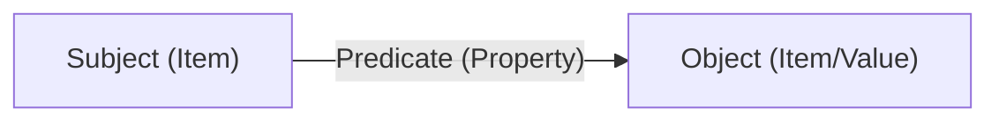

# Knowledge Graphs

A **knowledge graph** powers every World. Worlds organizes information in a
graph-based structure rather than rigid tables, allowing you to model complex
relationships with precision.

## Knowledge primitives

To build with Worlds, you must understand the three fundamental building blocks
of knowledge.

### 1. Items (entities)

**Items** are the distinct "things" in your World—a person, a piece of code, or
a company.

- **Identification**: Every item is identified by a unique **IRI**
  (Internationalized Resource Identifier).
- **Classes**: Items are categorized by their type (e.g., `User`, `Project`,
  `Task`).

### 2. Properties (predicates)

**Properties** are the "verbs" or "connectors" that define how items relate.

- **Examples**: `worksOn`, `managerOf`, `hasPriority`.
- **Ontology**: The set of defined properties forms the "grammar" of your World,
  ensuring your agents use consistent language.

### 3. Facts (triples)

A **fact** is created when you connect two items using a property. This follows
the standard W3C **RDF triple** structure:

| Component     | Example              |
| :------------ | :------------------- |
| **Subject**   | `User:Ethan`         |
| **Predicate** | `isWorkingOn`        |
| **Object**    | `Project:Worlds-API` |

## Why graphs matter: deterministic truth

Knowledge graph statements represent facts. Unlike statistical LLM weights,
Worlds retrieves specific, auditable relationships.

- **Malleability**: You can mutate and fork graphs in real-time.
- **Traceability**: Every claim has a symbolic path back to its source.
- **Evolution**: New facts can surgically update or override old ones to
  maintain grounded truth.

## Technical context

Worlds uses the **RDF 1.1** standard for universal portability. You can
interface with the graph through the [Worlds SDK](/getting-started/quickstart),
which abstracts away the complexity of raw SPARQL queries.
