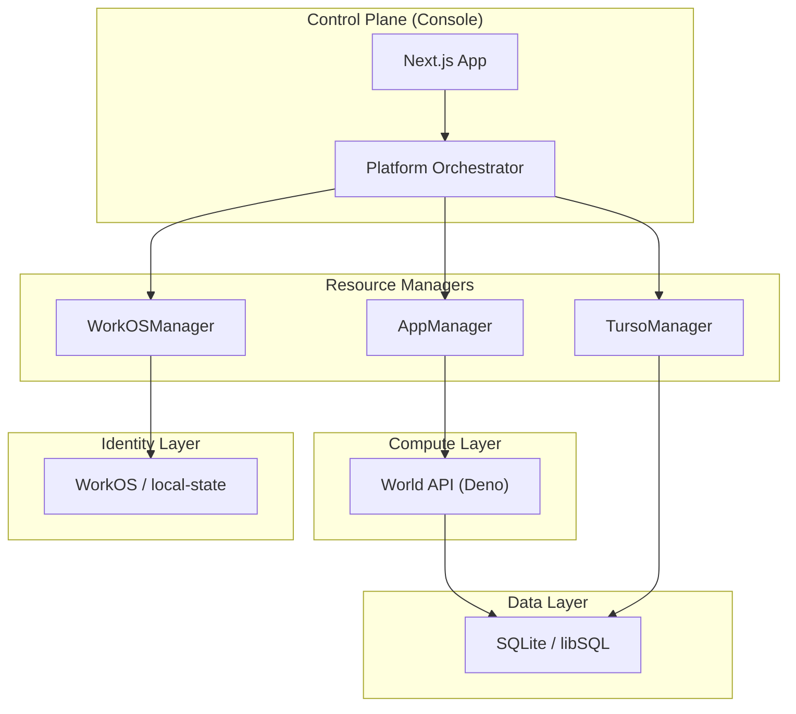
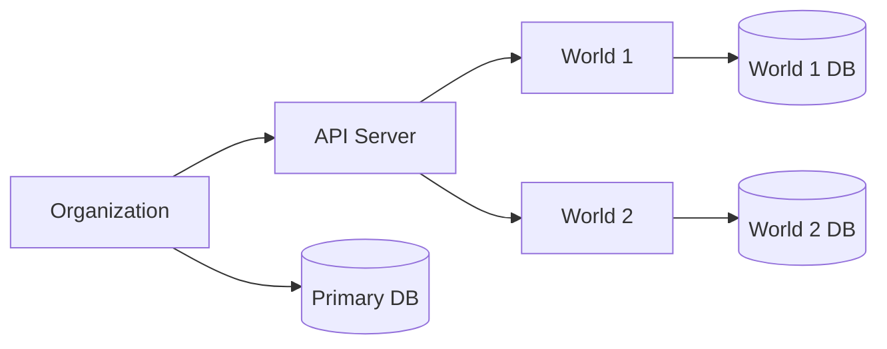

The Worlds Platform™ is built on a **polymorphic, hot-swappable architecture**. This means that whether you are running locally on a laptop or at scale in the cloud, the core logic remains identical while the underlying resource managers (for identity, storage, and compute) adapt to the environment.

## The Mental Model

At its core, the platform orchestrates three primary resource types across two distinct environment modes: **Local Dev** and **Production (Cloud)**.

### Resource Matrix

| Resource Type         | **Local Dev Mode** (File/Process backed)            | **Production Mode** (Remote/Cloud backed)    |
| :-------------------- | :-------------------------------------------------- | :------------------------------------------- |
| **Identity (WorkOS)** | `LocalWorkOSManager` (backed by `data/workos.json`) | `RemoteWorkOSManager` (WorkOS AuthKit & API) |
| **Compute (Apps)**    | `LocalAppManager` (Deno child processes)            | `DenoAppManager` (Deno Deploy / Sandbox API) |
| **Storage (Turso)**   | Local SQLite (backed by `data/{org_id}/worlds.db`)  | `RemoteTursoManager` (Turso Platform API)    |

### Architecture Diagram

---

## Resource Hierarchy

Understanding the relationship between **Organizations** and **Worlds** is key to managing the platform.

### 1. Organization (Tenant Level)

An Organization is the top-level grouping managed by the **Console**. When you provision an Organization, the platform creates:

- **World API Server**: A dedicated instance of the server (Deno process or Deno Deploy App).
- **Primary libSQL DB**: Stores metadata and the registry of worlds within that organization.
- **Admin API Key**: A unique secret that secures the entire Organization's API surface.
- **Base URL**: The public or local endpoint (e.g., `https://my-org.deno.dev`).

### 2. World (Domain Level)

A World is a specific context or "graph" managed _by_ the Organization's server.

- **Managed by WorldServer**: Worlds are sub-resources accessed via the Org's Base URL (e.g., `/v1/worlds/{id}`).
- **Dedicated Storage**: Each World has its own **secondary libSQL database** (SQLite file or per-world Turso DB) for its specific triples and embeddings.
- **Polymorphic Provisioning**: Just like Organizations, Worlds can be stored locally on disk or provisioned as cloud databases.

---

## Environment Configuration

The platform switches between modes based on the presence of specific environment variables.

### Management Console Requirements

These variables are required in `packages/console/.env`.

| Variable            | Mode       | Purpose                                                               |
| :------------------ | :--------- | :-------------------------------------------------------------------- |
| `WORKOS_API_KEY`    | Production | Enables Remote WorkOS Management.                                     |
| `WORKOS_CLIENT_ID`  | Production | Required for AuthKit login.                                           |
| `DENO_DEPLOY_TOKEN` | Production | Enables remote Deno Deploy orchestration.                             |
| `TURSO_API_TOKEN`   | Production | Enables remote Turso database provisioning.                           |
| `TURSO_ORG`         | Production | The Turso organization slug.                                          |
| (None)              | Local Dev  | If WorkOS keys are missing, the console defaults to file-backed mode. |

### World API Server Requirements

These are automatically provisioned and injected by the Console during deployment, but required if self-hosting the server manually.

| Variable            | Purpose                                                 |
| :------------------ | :------------------------------------------------------ |
| `ADMIN_API_KEY`     | Secures the World API; generated by the Console.        |
| `LIBSQL_URL`        | Connection string (e.g., `libsql://...` or `file:...`). |
| `LIBSQL_AUTH_TOKEN` | Auth token for remote libSQL/Turso instances.           |
| `GOOGLE_API_KEY`    | (Optional) For high-quality Gemini embeddings.          |

---

## Production Deployment Guide

To run a full production-grade instance of the Worlds Platform™, follow these steps:

### 1. Provision Infrastructure

- **Identity (WorkOS)**:
  - Create a project in [WorkOS](https://workos.com) and set up AuthKit.
  - **Retrieve**: `WORKOS_API_KEY`, `WORKOS_CLIENT_ID`, and `WORKOS_COOKIE_PASSWORD`.
- **Compute (Deno Deploy)**:
  - Generate a personal access token in [Deno Deploy](https://dash.deno.com).
  - **Retrieve**: `DENO_DEPLOY_TOKEN`.
- **Storage (Turso)**:
  - Create a [Turso](https://turso.tech) account and generate an API token.
  - **Retrieve**: `TURSO_API_TOKEN` and `TURSO_ORG`.

### 2. Deploy the Console

The Console is a standard Next.js application. You can deploy it to Vercel, Netlify, or a VPS.

- Set the environment variables retrieved in **Step 1** in your deployment settings.
- Ensure `NEXT_PUBLIC_WORKOS_REDIRECT_URI` matches your deployment callback URL.

### 3. Orchestrate Worlds

Once the Console is running:

1. Log in via AuthKit.
2. Create an **Organization**.
3. The platform will automatically:
   - Provision a new **Turso Database**.
   - Deploy a new **Deno Deploy App** running `packages/server`.
   - Link them together via metadata.

---

## Local Development

For instructions on running the entire ecosystem locally without cloud dependencies, see the [Development Guide](/development).
