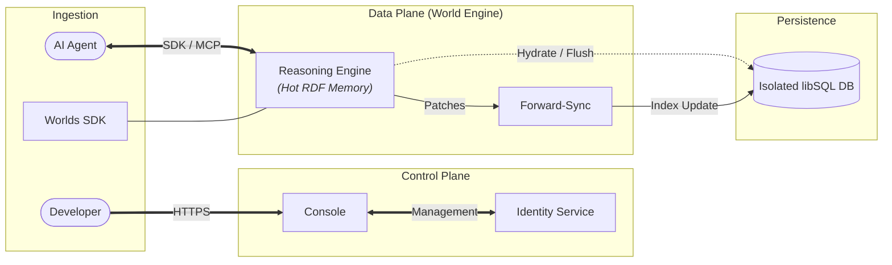
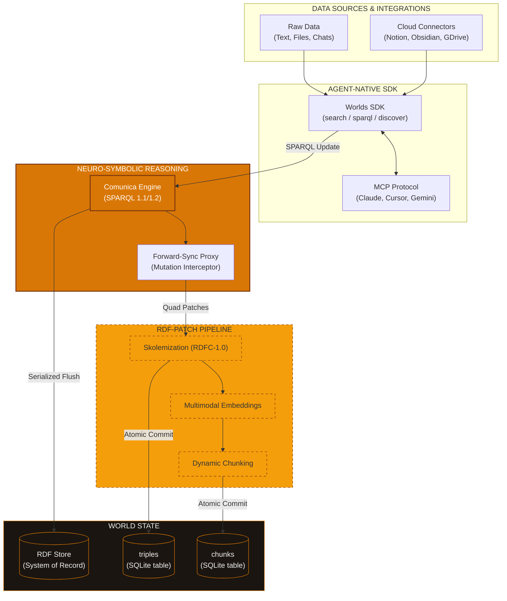
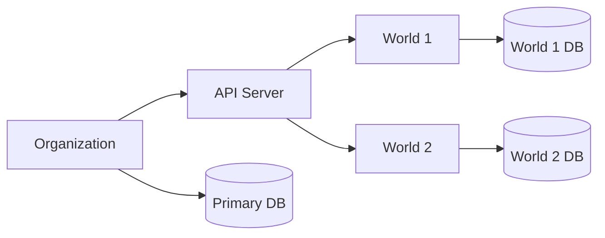
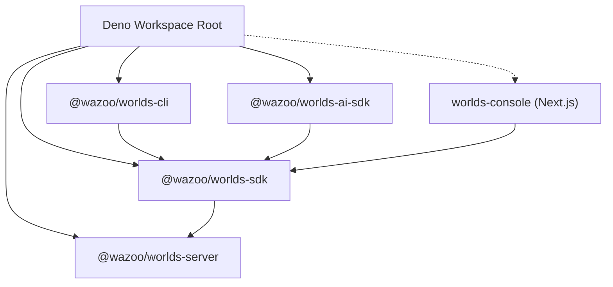

The Worlds platform utilizes a managed neuro-symbolic infrastructure designed
for edge-distributed, agentic memory. It separates a **Control Plane** (Console)
for management from a **Data Plane** (Worlds API) for high-performance
execution.

## High-level overview

The following diagram illustrates the relationship between the management layer,
the reasoning engine, and the isolated persistent state.



## Control vs. data plane

The platform splits operations into two primary layers:

### 1. Control plane (`packages/console`)

The **Management Console** acts as the system's brain. It manages identity
(WorkOS), handles organization-level provisioning, and orchestrates World Server
instances.

### 2. Data plane (`packages/server`)

The **Worlds API Server** handles RDF graph management, SPARQL execution, and
hybrid search. This is the data plane where your information lives.

## Data plane deep dive

The World Engine follows a multi-tiered data transformation journey, fusing
diverse input sources into a verifiable neuro-symbolic knowledge state.



## Resource hierarchy

Understanding the relationship between **Organizations** and **Worlds** is key
to managing isolation and scaling.



### Organizations (Tenant Level)

An Organization is the top-level grouping managed by the Console. Provisioning
an Organization initializes a dedicated API server instance, a primary metadata
database, and an admin security boundary.

### Worlds (Domain Level)

A World is a specific context or graph managed by the Organization's server.

- **Dedicated Storage**: Each World maintains its own secondary libSQL database
  for triples and embeddings.
- **Isolation**: Worlds are sub-resources accessed via the Org's base URL (e.g.,
  `/v1/worlds/{id}`), ensuring zero cross-contamination.

## Monorepo topology

The ecosystem uses a Deno workspace. The `sdk` package serves as the primary
bridge for the CLI, AI-SDK, and Console to communicate with the API Server.



### Repository layout

The server follows a modular layout organized by service and resource:

```text
packages/server/
├── context.ts         # ServerContext shared by every route
├── lib/               # Shared logic and utilities
│   ├── ai-sdk/        # AI SDK integration
│   ├── blob/          # RDF/SPARQL blob and store handling
│   ├── database/      # Database layer and managers
│   ├── embeddings/    # Embeddings interface and implementations
│   ├── errors/        # ErrorResponse helpers
│   ├── rdf-patch/     # RDF patch application logic
│   └── testing/       # TestContext and testing utilities
├── main.ts            # Deno serve entrypoint
├── middleware/        # auth.ts, rate-limit.ts
├── models/            # OpenAPI models and shared types
├── routes/            # v1 API routes
└── server.ts          # createServer, createServerContext
```

- **Entrypoints**: `packages/server/main.ts` (server) and `packages/cli/main.ts`
  (CLI).
- **Import alias**: The `#/` alias maps to `./` within each package.

---

## Request flow

The Worlds server follows a structured lifecycle for initialization and request
handling. For a detailed breakdown of the startup process and per-request cycle,
refer to the [Request flow](/reference/request-flow) reference.

---

## Design principles

## Polymorphic resource managers

A key design feature is the use of hot-swappable resource managers. The core
logic remains identical, while the implementation swaps based on the
environment:

| Resource     | Local dev implementation   | Production implementation |
| :----------- | :------------------------- | :------------------------ |
| **Compute**  | Local Deno child processes | Deno Deploy               |
| **Storage**  | Local SQLite files         | Turso (libSQL)            |
| **Identity** | Mock file (`workos.json`)  | WorkOS AuthKit            |

This pattern allows the entire stack to run locally with zero cloud
dependencies.
