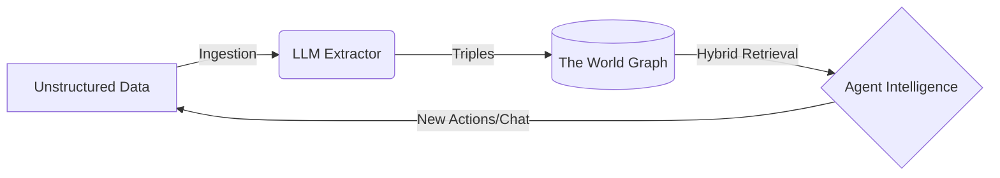

# Core Features

Worlds provides a structured framework for **Agent Memory**. Instead of treating
an agent's context as a flat list of chat logs or disjointed text chunks, Worlds
organizes information as a **dynamic, queryable model of reality**.

## The Worlds Pipeline

To understand how Worlds powers intelligent agents, you need to understand the
lifecycle of data moving through the platform.

### 1. Ingestion (The Input)

Raw information enters the system—from a user chat, a GitHub repository, or a
PDF. At this stage, the data is unstructured human language.

### 2. Processing (The Neuro-Symbolic Engine)

The Worlds Engine uses LLMs to extract **meaning** and **entities**. It
translates ambiguous language into structured **Triples** (Subject -> Predicate
-> Object). These facts are then merged into a **World**—an isolated container
where the graph evolves through:

- **Updating** conflicting facts.
- **Extending** existing entities with new context.
- **Inferring** hidden relationships via symbolic reasoning.

### 3. Retrieval (The Output)

When an agent needs context, it performs a **Hybrid Search**. This mixes
semantic vector similarity with deterministic graph traversal to pull a highly
precise, grounded slice of reality directly into its context window.

---

# Storage Engine

To achieve both semantic flexibility and structural precision, we employ a
hybrid storage strategy.

### n3 (hot memory)

An in-memory, WASM-compiled RDF store that supports SPARQL. This allows for
complex graph pattern matching (e.g., recursive queries, property paths) that
SQL and Vectors cannot easily handle.

- **Pre-loading**: WASM modules are pre-loaded to ensure "warm" isolates.
- **Hydration**: Graph state is hydrated from the SQLite "System of Record" upon
  initialization.
- **Edge Cache**: Hot state persists in the Edge Cache between requests for
  millisecond read latency.

### Standard SQLite (hot & cold storage)

We utilize a **Hybrid Schema** for persistence to avoid the overhead of
general-purpose SPARQL engines on disk while maintaining semantic integrity.

- **`triples` Table**: Stores atomic units of knowledge (Subject, Predicate,
  Object).
- **`chunks` Table**: Stores overlapping text segments with vector embeddings
  (targeting string literals) and ranks derived from triple data.
- **`entity_types` Table**: An optimized table for mapping entities to their
  `rdf:type` IRIs, enabling rapid structural filtering.
- **`blobs` Table**: Handles large-scale RDF data and file-based state.

### Hybrid search & RRF

We utilize **Reciprocal Rank Fusion (RRF)** to combine results from distinct
indices into a single, unified relevance ranking:

- **Semantic Search (Vector Index)**: Captures conceptual meaning using
  high-dimensional embeddings (1536-dim).
- **Keyword Search (FTS5)**: Provides exact term matching using the BM25 ranking
  algorithm.
- **Graph Context**: Restricts search results based on structural RDF
  relationships (subject/predicate filters).

The fusion algorithm follows the industry-standard RRF formula:

$$score = \sum_{d \in D} \frac{1}{60 + rank(d)}$$

---

## Technical Specifications

For a deeper dive into the mathematical and philosophical foundations of the
Worlds storage engine, please refer to our [Whitepaper](/overview/whitepaper).
