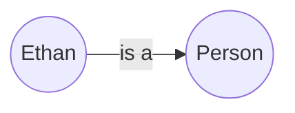
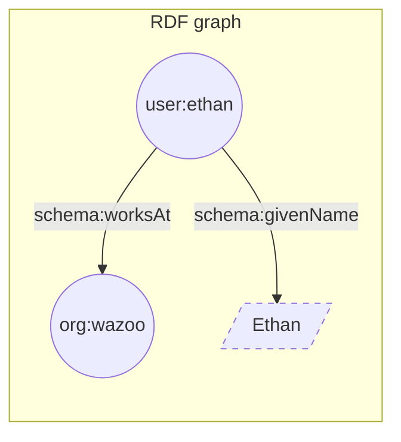

A world is a stateful knowledge graph engine that functions as an agent's
memory.

<div align="center">


</div>

A world is made of items made of facts.

## Items

Worlds represent everything as an item, including the types themselves. This
recursive structure enables granular, multi-hop reasoning.

An item is...

- Assigned a unique
  [IRI](https://en.wikipedia.org/wiki/Internationalized_Resource_Identifier).
- Defined by one or more facts.
- Any "thing" in your world, including documents, people, physical objects, and
  abstract concepts.

## Properties

Properties are the relationships that connect items together. Just as items are
the "nouns" of your world, properties are the "verbs" (e.g., `worksAt` or
`isA`). The set of all valid properties forms the **ontology**—the grammar your
agents use to interact.

## Facts

A fact is a unit of data expressed as a structured statement that connects two
items using a property. Every fact is inherently bound to the dimension of
**time**. Worlds maintains an append-only, chronological ledger of facts,
allowing agents to understand exactly how state and information evolve.

Conceptually, a fact functions exactly like a simple sentence. For example, the
sentence, "Ethan is a person", can be represented as:

<div align="center">



</div>

## Triples

Computers store facts in a data structure called the **triple**, which is built
from three components called **terms**.

### Anatomy

<Frame caption="Analogy between triples and molecules">


</Frame>

<ResponseField name="Subject" type="Term">
  The item you are describing e.g., `user:ethan`
</ResponseField>

<ResponseField name="Predicate" type="Term">
  The structural representation of a property e.g., `rdf:type`
</ResponseField>

<ResponseField name="Object" type="Term">
  Another item or a raw data value e.g., `schema:Person`
</ResponseField>

### Topography

The **Object** of a triple determines how the graph grows. Facts branch into two
types:

- **Item-to-item:** Connects two distinct items e.g., `user:ethan` ->
  `schema:worksAt` -> `org:wazoo`
- **Item-to-value:** Connects an item to a raw data value, adding searchable
  detail but acting as a terminal point e.g., `user:ethan` -> `schema:givenName`
  -> `"Ethan"`

<div align="center">



</div>

### Serialization

To write these triples in code, Worlds uses **Turtle**, a standard RDF
serialization format.

To assert "Ethan is a person", the syntax goes:

```turtle Turtle
user:ethan a schema:Person .
```

To expand on an item, use a semicolon `;` to chain multiple facts together.
Here, we assert that Ethan is a person, and his literal name is "Ethan".

```turtle Turtle
user:ethan a schema:Person ;
 schema:givenName "Ethan" .
```

## Why care?

Worlds is built on standard knowledge representation formats. This provides
autonomous agents with an established, interoperable foundation for reasoning.
