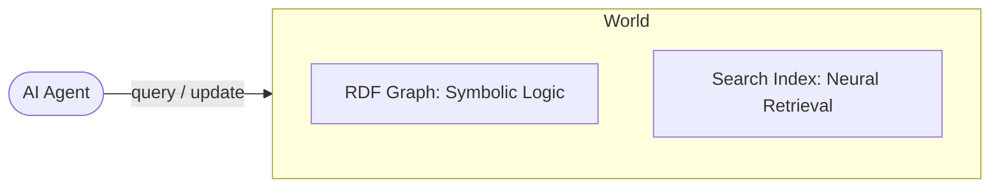
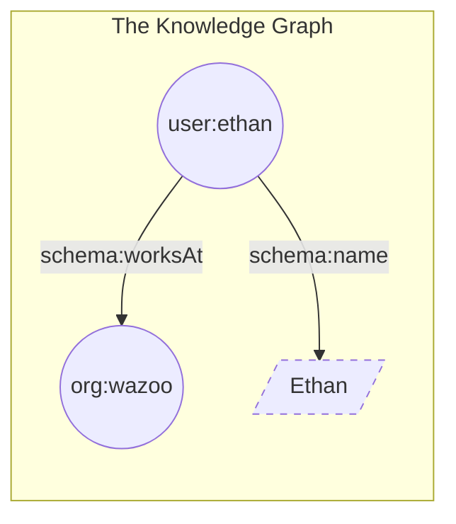

A world is a dedicated space where an agent stores what it knows. Think of it as a sandbox that combines two ways of "knowing":

1.  **The symbolic layer (RDF graph):** Precise, structured facts (e.g., "Ethan works at Wazoo").
2.  **The neural layer (search index):** Fuzzy, natural-language retrieval (e.g., "Find notes about Ethan's job").

By pairing these, an agent doesn't just "find" information—it *understands* the relationships between the entities it discovers.



## Items

In a world, every distinct entity—a person, a document, a project, or even a specific concept—is an item.

If your knowledge base were a house, the items would be the furniture, the people living there, and the house itself. On their own, items are just isolated points of data. To make them useful, we give them a unique identification (an IRI) and a classification.

**Example:**
To the system, "Ethan" isn't just a string of text; he is an item of the type `Person`.

<CodeGroup>

```turtle Turtle
user:ethan a schema:Person .
```

</CodeGroup>

<Note>
  In a world, everything is an item—including the types themselves. This "recursive" structure allows the agent to reason about the *category* of a person just as easily as the person themselves.
</Note>

## Facts

You build a world by connecting items together using facts.

A fact is the smallest unit of truth in a world. We represent these as triples, a three-part structure that functions exactly like a simple sentence: **Subject → Predicate → Object.**

| Component | Analogy | Description | Example |
| :--- | :--- | :--- | :--- |
| **Subject** | The "Who" | The item you are describing. | `user:ethan` |
| **Predicate** | The "Does" | The relationship or property. | `schema:worksAt` |
| **Object** | The "What" | Another item or a raw value. | `org:wazoo` |

Together, these form a clear statement: **"Ethan works at Wazoo."**

### Anatomy of a fact

Facts aren't just limited to connecting two items. They can also attach raw data (literals) to an item.

- **Item-to-item:** Connects two nodes (e.g., `Ethan` → `works at` → `Wazoo`). This expands the graph.
- **Item-to-value:** Connects a node to a "literal" (e.g., `Ethan` → `has name` → `"Ethan"`). This adds detail but terminates the path.



## Why this matters for Agents

Standard databases see text; Worlds see context.

Because every fact shares the exact same triple structure, the graph grows organically without the need for complex table joins or schema migrations. When an agent queries a world, it can "walk" the facts to discover non-obvious knowledge. 

<Info>
**Inference Example**

1.  **Fact A**: Ethan works at Wazoo.
2.  **Fact B**: Wazoo is located in San Francisco.
3.  **Agent Inference**: Ethan is likely located in (or associated with) San Francisco.
</Info>

By combining these logical, structured facts with a search index, your agent can use semantic search to instantly find the right item, and then transition cleanly into using the RDF graph to reason about everything connected to it.


