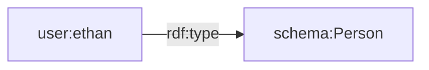
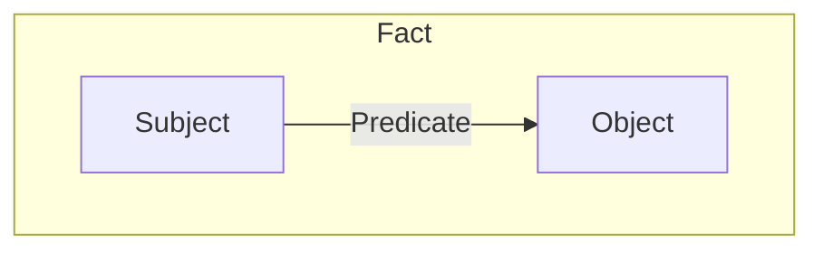
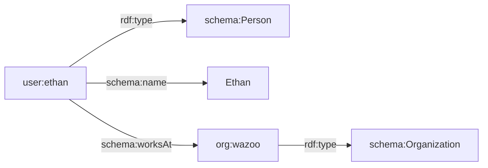
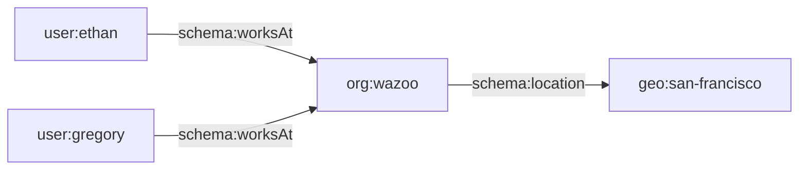

A **World** is a knowledge store for agent world memory and reasoning. It pairs
an **RDF graph**, functioning as the symbolic layer, with a **search index**,
acting as the neural layer.

A World acts as a bridge between structured knowledge and semantic search.


## Items

An item is any distinct "thing" in your world, such as a person, a document, a
company, or a concept. Every world is composed entirely of items connected by
**facts**.

An item is identified by a unique
[IRI](https://en.wikipedia.org/wiki/Internationalized_Resource_Identifier) and
can be categorized by a type.

<CodeGroup>
```turtle Turtle
user:ethan a schema:Person .
```
</CodeGroup>



## Facts

Every world starts empty. You populate it by connecting items together using
facts.

A fact is a discrete unit of information expressed as a structured statement.

## Triples

<Note>
  **Mental model:** Everything in a World reduces to triples. There are no
  tables, rows, or document bodies—just statements.
</Note>

Each fact is represented as a triple, the fundamental unit of meaning in RDF
graphs.

You construct these statements as "triples" because every fact always comprises
exactly three components:



A triple reads exactly like a simple sentence: Subject -> Predicate -> Object.

| Component     | Role                         | Example          |
| :------------ | :--------------------------- | :--------------- |
| **Subject**   | The item being described     | `user:ethan`     |
| **Predicate** | The relationship or property | `schema:worksAt` |
| **Object**    | The target value or item     | `org:wazoo`      |

Together they read as a simple statement: **Ethan works at Wazoo.**

The subject and predicate must always be unique identifiers (IRIs). The object
can either reference another item's IRI, or be a literal value, such as a
string, number, or date.

### Anatomy of a triple


A triple statement is built from fundamental components called RDF terms. There
are two primary types of nodes that make up these terms:

- **Named nodes (URIs/IRIs)**: Unique identifiers that point to specific, global
  items or properties. Subjects and Predicates must always be named nodes,
  allowing them to explicitly link to other parts of the graph.
- **Literal nodes (Values)**: Raw data values, such as strings, numbers, or
  dates, like `"Ethan"` or `42`. Literals can only ever be Objects. They sit at
  the edge of the graph and cannot have outbound relationships.

## Building a world

To collapse these concepts into a single, progressive example: create an item,
give it a type, assign it a name, and connect it to a company.

Here is the complete journey represented visually and in code:

<CodeGroup>
```turtle Turtle
# 1. Create the user item and its type
user:ethan a schema:Person ;
  # 2. Add a literal fact (name)
  schema:name "Ethan" ;
  # 3. Add a relational fact (works at)
  schema:worksAt org:wazoo .

# 4. Create the company item and its type

org:wazoo a schema:Organization .
```
</CodeGroup>



## Ontologies and reasoning

Why use triples instead of standard database rows? Because applying formal
ontologies—which act as strict definitions of properties and classes—to these
triples resolves semantic ambiguity.

By rigidly defining how items can relate to each other, Worlds intercepts
context-blind misinterpretations from underlying language models.



Structured ontologies allow agents to perform deterministic, multi-hop
reasoning; inferring new knowledge deterministically from existing facts.
