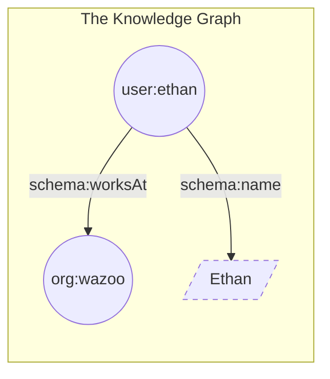

A world is a stateful knowledge graph that functions as an agent's memory. It
operates on a neuro-symbolic architecture linking two storage layers:

- **The symbolic layer (RDF graph):** Deterministic, structural relationships
  (e.g., "Ethan works at Wazoo").
- **The neural layer (search index):** Probabilistic, semantic retrieval (e.g.,
  "Find notes about Ethan's job").

By pairing these layers, an agent doesn't just "find" information. It creates a
substrate that understands the relationships between the items it discovers.


## Items

An item is any distinct "thing" in your world, such as a person, a book, a
company, a workspace, or a concept. Every item is represented as a structural
node within the knowledge graph.

On their own, items are just isolated points of data. To make them useful, we
give them a unique identification (an IRI) and a classification.

**Example:** To the system, "Ethan" isn't just a string of text. He is an item
of the type `schema:Person`.

<CodeGroup>

```turtle Turtle
user:ethan a schema:Person .
```

</CodeGroup>

<Note>
  In a world, everything is an item, including the types themselves. This
  "recursive" structure allows the agent to reason about the *category* of a
  person just as easily as the person themselves.
</Note>

## Facts

You build a world by connecting items together using facts.

A fact is a single unit of information expressed as a structured statement. We
represent these as triples, a three-part structure that functions exactly like a
simple sentence: **Subject -> Predicate -> Object.**

| Component     | Analogy    | Description                   | Example          |
| :------------ | :--------- | :---------------------------- | :--------------- |
| **Subject**   | The "Who"  | The item you are describing.  | `user:ethan`     |
| **Predicate** | The "Does" | The relationship or property. | `schema:worksAt` |
| **Object**    | The "What" | Another item or a raw value.  | `org:wazoo`      |

Together, these form a clear statement: **"Ethan works at Wazoo."**

Expanding on our `user:ethan` item from earlier, we can add a fact that asserts
his name.

<CodeGroup>

```turtle Turtle
user:ethan a schema:Person ;
  schema:name "Ethan" .
```

</CodeGroup>

### Anatomy of a fact


Facts aren't just limited to connecting two items. They can also attach raw data
(literals) to an item.

- **Item-to-item (Named node):** Connects two nodes (e.g., `user:ethan` ->
  `schema:worksAt` -> `org:wazoo`). This explicitly links to other parts of the
  graph and expands it.
- **Item-to-value (Literal node):** Connects a node to a raw data value (e.g.,
  `user:ethan` -> `schema:name` -> `"Ethan"`). This adds detail but terminates
  the path.



## Why this matters for Agents

Standard databases see text. Worlds see context.

Because every fact shares the exact same triple structure, the graph grows
organically without the need for complex table joins or schema migrations. When
an agent queries a world, it can "walk" the facts to discover non-obvious
knowledge.

<Info>
**Inference Example**

1.  **Fact A**: Ethan works at Wazoo.
2.  **Fact B**: Wazoo is located in San Francisco.
3.  **Agent Inference**: Ethan is likely located in (or associated with) San
    Francisco.

</Info>

By combining facts with a search index, agents can use semantic search to
instantly find the right item, and then switch to reasoning over the RDF graph.
