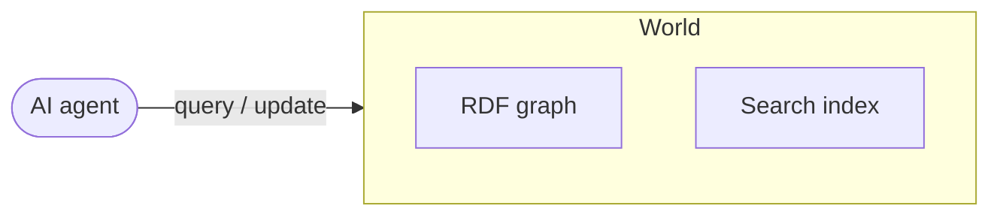
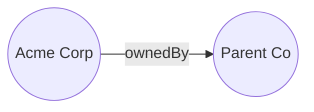
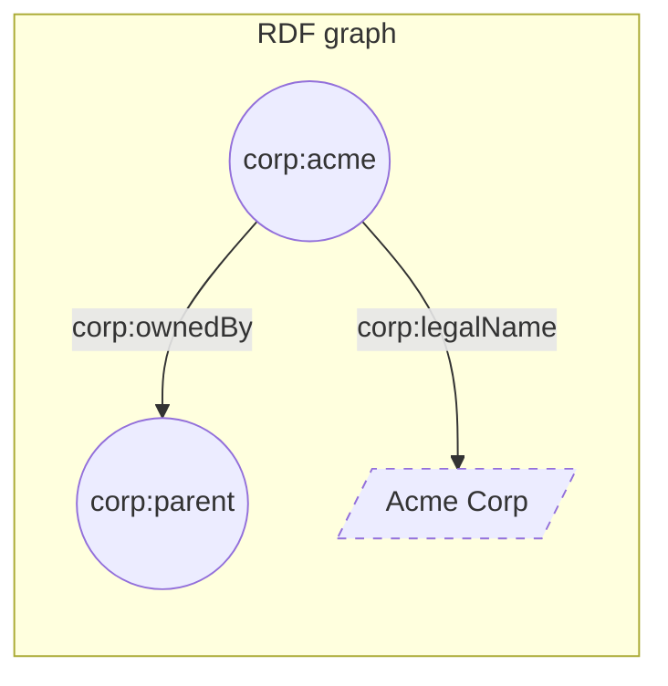

A world is a stateful knowledge graph engine that functions as an agent's
verifiable context.

<div align="center">



</div>

A world is made of items made of facts.

## Items

Worlds represent everything as an item, including the types themselves. This
recursive structure enables granular, multi-hop reasoning.

An item is...

- Assigned a unique
  [IRI](https://en.wikipedia.org/wiki/Internationalized_Resource_Identifier).
- Defined by one or more facts.
- Any "thing" in your world, including documents, people, physical objects, and
  abstract concepts.

## Properties

Properties connect items. They define actions or attributes, such as `worksAt`
or `givenName`. The complete set of valid properties forms the ontology. Agents
use this ontology to interact with the graph.

## Facts

A fact is a unit of data expressed as a structured statement that connects two
items using a property. Every fact is inherently bound to the dimension of
**time**. Worlds maintains an append-only, chronological ledger of facts,
allowing agents to understand exactly how state and information evolve.

Conceptually, a fact functions exactly like a structured assertion. For example,
the assertion "Acme Corp is owned by Parent Co" can be represented as:

<div align="center">



</div>

## Triples

Computers store facts in a data structure called the **triple**, which is built
from three components called **terms**.

### Anatomy

<Frame caption="Analogy between triples and molecules">


</Frame>

<ResponseField name="Subject" type="Term">
  The item you are describing e.g., `user:ethan`
</ResponseField>

<ResponseField name="Predicate" type="Term">
  The structural representation of a property e.g., `rdf:type`
</ResponseField>

<ResponseField name="Object" type="Term">
  Another item or a raw data value e.g., `schema:Person`
</ResponseField>

### Topography

The **Object** of a triple determines how the graph grows. Facts branch into two
types:

- **Item-to-item:** Connects two distinct items e.g., `user:ethan` ->
  `schema:worksAt` -> `org:wazoo`
- **Item-to-value:** Connects an item to a raw data value, adding searchable
  detail but acting as a terminal point e.g., `user:ethan` -> `schema:givenName`
  -> `"Ethan"`

<div align="center">



</div>

### Serialization

To write these triples in code, Worlds uses **Turtle**, a standard RDF
serialization format.

To assert "Acme Corp is a Legal Entity", the syntax goes:

```turtle Turtle
corp:acme a schema:Organization .
```

To expand on an item, use a semicolon `;` to chain multiple facts together.
Here, we assert that Acme Corp is an organization, and its legal name is "Acme
Corp".

```turtle Turtle
corp:acme a schema:Organization ;
 schema:legalName "Acme Corp" .
```

## Verification

To verify a fact, Worlds uses the SPARQL **ASK** query. This provides a
deterministic boolean answer without probabilistic guessing.

For example, to verify if "Acme Corp is owned by Parent Co", use:

```sparql SPARQL
PREFIX corp: <http://corp.example/>

ASK WHERE {
  corp:acme corp:ownedBy corp:parent .
}
```

In the SDK, use the `sparql` method to perform this check:

```typescript TypeScript
// Worlds.sparql accepts either a world ID or a human-readable slug.
const result = await worlds.sparql(
  "my-world-slug",
  "PREFIX corp: <http://corp.example/> ASK WHERE { corp:acme corp:ownedBy corp:parent . }",
);

if (result.boolean) {
  // Fact is verified
}
```

## Why care?

Worlds is built on standard knowledge representation formats. This provides
autonomous agents with an established, interoperable foundation for reasoning.
