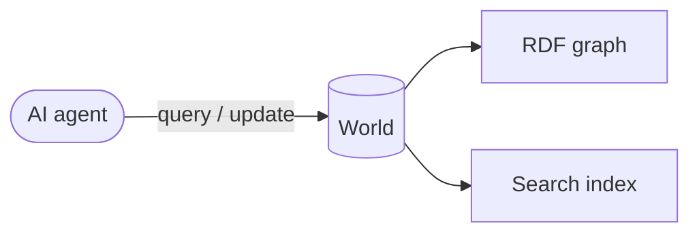
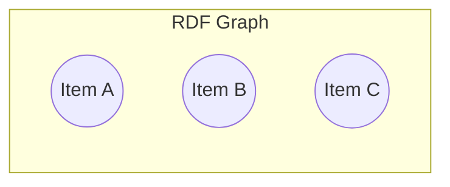
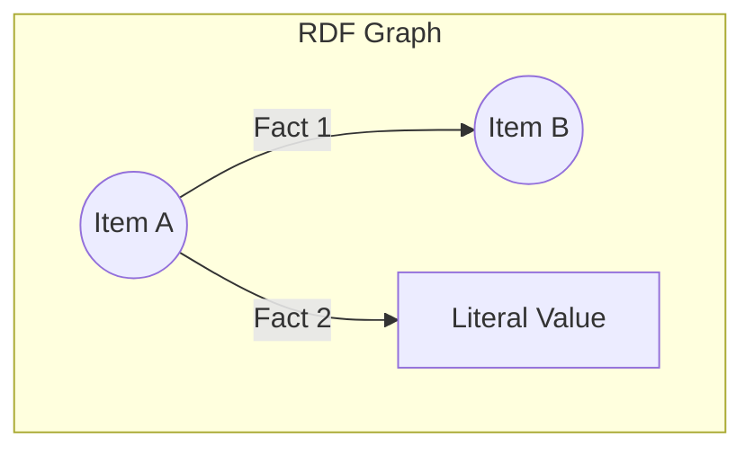
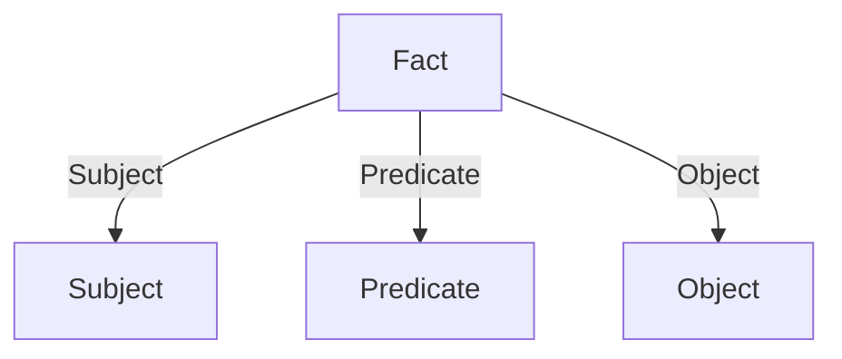
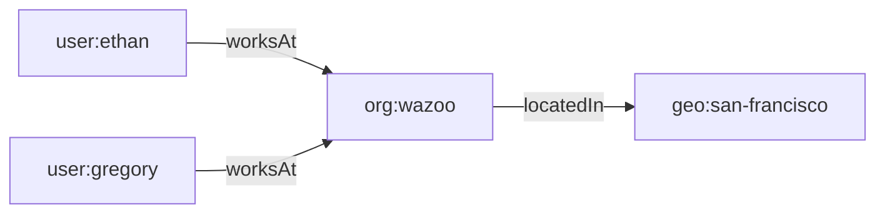

A **World** is an isolated database for agents to store and query context. It
pairs an **RDF graph**, functioning as the symbolic layer, with a **search
index** layer. Together they allow an agent to reason over structured facts
_and_ perform natural-language retrieval within the same container.



Inside every World, the knowledge graph is constructed entirely of **items**
connected by **facts**.



## Items

An item is any distinct "thing" in your world, such as a person, a book, a
company, a workspace, or a concept. Every item is represented as a structural
node within the knowledge graph.

An item is identified by a unique [IRI](https://en.wikipedia.org/wiki/Internationalized_Resource_Identifier) and can be categorized by types.

For example, we can create an item representing a user with the IRI `user:ethan` and assign it the type `schema:Person`. Items can be formalized graphically as nodes or mathematically mapped using standard RDF serialization like Turtle. 

Note that the type of every item is also represented as a fact—it's facts all the way down.

```mermaid
graph LR
    A[user:ethan] -->|@type| B[schema:Person]
```

<CodeGroup>

```turtle Turtle
user:ethan a schema:Person .
```

</CodeGroup>

While items represent the core entities in your world, they don't mean much on
their own.

## Facts

Every world starts empty—you populate it by creating items and connecting them
together using facts.



A fact is a single unit of information expressed as a structured statement.
Facts are stored as triples (though in other literature they may be referred to
as triplets, quads, edges, or tuples). The term "triple" emphasizes that every
fact comprises three components:



| Component     | Role                         | Example          |
| :------------ | :--------------------------- | :--------------- |
| **Subject**   | The item being described     | `user:ethan`     |
| **Predicate** | The relationship or property | `schema:worksAt` |
| **Object**    | The target value or item     | `org:wazoo`      |

Together they read as a single statement: **Ethan works at Wazoo.**

Expanding on our `user:ethan` item from earlier, we can add a fact that asserts
his name.

<CodeGroup>

```turtle Turtle
user:ethan a schema:Person ;
  schema:name "Ethan" .
```

</CodeGroup>

```mermaid
graph LR
    A[user:ethan] -->|@type| B[schema:Person]
    A -->|schema:name| C["&quot;Ethan&quot;"]
```

### Anatomy of a triple


A triple statement is built from fundamental components called RDF terms. There
are two primary types of nodes that make up these terms:

- **Named nodes (URIs/IRIs)**: Unique identifiers that point to specific, global
  items or properties. Subjects and Predicates must always be named nodes,
  allowing them to explicitly link to other parts of the graph.
- **Literal nodes (Values)**: Raw data values, such as strings, numbers, or
  dates like `"Ethan"` or `42`. Literals can only ever be Objects. They sit at
  the edge of the graph and cannot have outbound relationships.

When an object named node is connected to a subject named node via a predicate
named node, the graph expands. When it connects to a literal node, the path
terminates.

### Why triples and ontologies?

Triples follow the
[RDF (Resource Description Framework)](https://www.w3.org/TR/rdf-primer/)
standard. Because every fact shares the same structure, triples compose
naturally into a graph—no schema migrations, no table joins.

Applying formal ontologies to these triples resolves semantic disambiguation and
contextual ambiguity. By rigidly defining properties and classes, Worlds
intercepts context-blind misinterpretations from the underlying language model.



As the graph grows, the agent can traverse relationships to infer new knowledge,
for example, that Ethan and Gregory share the same work location.
